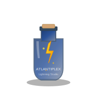

# ⚡ Atlantiplex Lightning Studio

> **Enterprise Multi-Tenant SaaS Broadcasting Platform**

[](https://python.org)
[](https://flask.palletsprojects.com)
[](LICENSE)
[](https://stripe.com)

<p align="center">
  
</p>

## 🚀 Overview

Atlantiplex Lightning Studio is a **production-ready, enterprise-grade multi-tenant SaaS platform** for professional broadcasting and streaming. Built with Flask and featuring complete Stripe billing integration, multi-tenant architecture, and team management capabilities.

### ✨ Key Features

- 🏢 **Multi-Tenant Architecture** - Complete tenant isolation with subdomain routing
- 💰 **Subscription Billing** - 5-tier pricing with Stripe integration
- 👥 **Team Management** - Hierarchical teams with role-based access control
- 📊 **Real-time Analytics** - Usage tracking and billing dashboards
- 🔒 **Enterprise Security** - Audit logging, RBAC, session management
- 🎨 **Modern UI** - Glassmorphism design with responsive layout
- 🎬 **Broadcasting** - Professional streaming with guest management
- ☁️ **Cloud Ready** - Azure, AWS, GCP deployment guides

## 📁 Project Structure

```
├── branding/           # Brand assets and logos
├── docs/              # Documentation and guides
├── launchers/         # Windows batch launchers
├── main/              # Core Python modules
├── matrix-studio/     # Main SaaS application
│   ├── core/         # Core backend modules
│   ├── web/          # Frontend applications
│   └── *.py          # SaaS platform files
├── tests/            # Test suites
└── tools/            # Utility scripts
```

## 🛠️ Quick Start

### Prerequisites

- Python 3.11+
- pip
- Git

### Installation

```bash
# Clone the repository
git clone https://github.com/yourusername/atlantiplex-lightning-studio.git
cd atlantiplex-lightning-studio

# Install dependencies
pip install -r matrix-studio/requirements_payments.txt

# Run the SaaS platform
cd matrix-studio
python saas_platform.py
```

### Access the Application

- **Main Platform**: http://localhost:8080
- **Health Check**: http://localhost:8080/health
- **API Base**: http://localhost:8080/api

## 💳 Subscription Tiers

| Tier | Price | Users | Storage | Features |
|------|-------|-------|---------|----------|
| **Free** | $0 | 5 | 5GB | Basic streaming |
| **Starter** | $9.99/mo | 20 | 50GB | HD streaming, 2 platforms |
| **Professional** | $29.99/mo | 100 | 500GB | Full HD, API access |
| **Enterprise** | $99.99/mo | ∞ | ∞ | 4K, white-label, SSO |
| **Admin** | $0 | ∞ | ∞ | Full system access |

## 🏗️ Architecture

### Tech Stack

- **Backend**: Flask 3.0+, Python 3.11+
- **Database**: PostgreSQL (production) / SQLite (development)
- **Cache**: Redis
- **Payments**: Stripe
- **Frontend**: React + Vite
- **Deployment**: Docker, Azure App Service

### Multi-Tenant Design

```
┌─────────────────────────────────────────┐
│         Tenant Middleware               │
│    (subdomain routing & isolation)      │
└─────────────────────────────────────────┘
                   ↓
┌─────────────────────────────────────────┐
│      SaaS Platform (Flask)              │
│  • MultiTenantManager                   │
│  • StripePaymentManager                 │
│  • SaaSDashboard                        │
└─────────────────────────────────────────┘
                   ↓
┌──────────────┬──────────────┬───────────┐
│  PostgreSQL  │    Redis     │  Storage  │
│   (Tenants)  │   (Cache)    │  (Media)  │
└──────────────┴──────────────┴───────────┘
```

## 📖 Documentation

- [SaaS Transformation Summary](docs/SAAS_TRANSFORMATION_SUMMARY.md)
- [Stripe Backend Analysis](docs/STRIPE_BACKEND_ANALYSIS.md)
- [Pricing Tiers Analysis](docs/PRICING_TIERS_ANALYSIS.md)
- [Azure Hosting Guide](docs/AZURE_HOSTING_GUIDE.md)
- [Testing Report](docs/TESTING_REPORT.md)

## ☁️ Deployment

### Azure (Recommended)

See [Azure Hosting Guide](docs/AZURE_HOSTING_GUIDE.md) for detailed instructions.

Quick deploy:
```bash
az group create --name atlantiplex-rg --location eastus
az webapp create --resource-group atlantiplex-rg --name atlantiplex-saas
```

### Docker

```bash
docker build -t atlantiplex-saas .
docker run -p 8080:8080 atlantiplex-saas
```

## 🧪 Testing

```bash
# Run all tests
cd matrix-studio
python test_stripe_backend.py
python analyze_pricing_tiers.py

# Quick component test
python test_saas_quick.py
```

## 🔐 Security

- ✅ **Tenant Isolation** - Complete data separation
- ✅ **RBAC** - Role-based access control
- ✅ **Audit Logging** - Complete action tracking
- ✅ **API Rate Limiting** - Prevent abuse
- ✅ **Session Management** - Configurable timeouts
- ✅ **Stripe Webhook Verification** - Secure payment processing

## 🤝 Contributing

1. Fork the repository
2. Create your feature branch (`git checkout -b feature/amazing-feature`)
3. Commit your changes (`git commit -m 'Add amazing feature'`)
4. Push to the branch (`git push origin feature/amazing-feature`)
5. Open a Pull Request

## 📄 License

This project is licensed under the MIT License - see the [LICENSE](LICENSE) file for details.

## 🙏 Acknowledgments

- Flask team for the amazing web framework
- Stripe for payment processing
- Microsoft Azure for cloud infrastructure
- All contributors who helped build this platform

## 📞 Support & Contact

**Studio:** Seraphonix Studios  
**Email:** seraphonixstudios@gmail.com  
**Website:** https://verilysovereign.org  
**Twitter/X:** [@r1914514](https://twitter.com/r1914514)

## 🚀 Roadmap

- [ ] Mobile app (iOS/Android)
- [ ] Advanced analytics dashboard
- [ ] AI-powered features
- [ ] White-label mobile SDK
- [ ] Marketplace for plugins
- [ ] Multi-region deployment

---

<p align="center">
  <strong>Built with ⚡ by the Atlantiplex Team</strong>
</p>

<p align="center">
  <a href="https://twitter.com/r1914514">Twitter</a> •
  <a href="https://verilysovereign.org">Website</a>
</p>